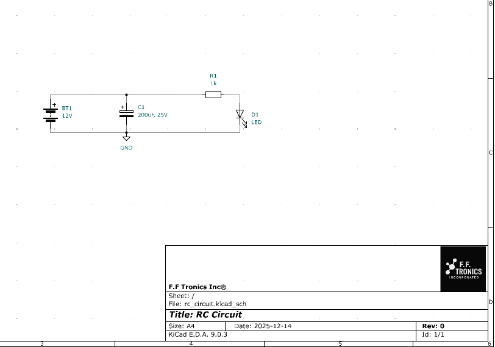
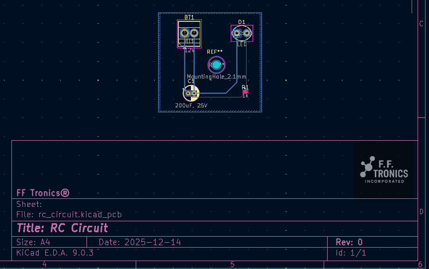
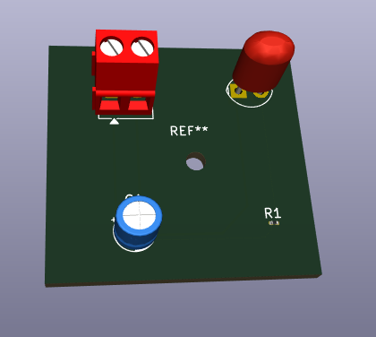

# ⚡ PROJECT_NAME – PCB Design (KiCad)

A PCB design created in KiCad as part of my electronics and PCB engineering practice.  
This project includes the schematic, PCB layout, 3D visualization, and simulation results.

---

## 🧩 Overview
- **Tool Used:** KiCad 
- **Microcontroller:**  None  
- **Board Type:** Single-layer 
- **Power:** 12V  
- **Purpose:** Testing concepts, training, portfolio development.

---

## 🛠️ Project Files
- `rc_circuit.kiCad_sch` – Schematic file  
- `rc_circuit.kiCad_pcb` – PCB layout file  
- `Images/` – Screenshots 

---

## 🖼️ Images

### Schematic  

### PCB Layout  

### 3D View  

---

## 🎞️ Simulation  
A short simulation of the circuit:  
`simulation.mp4`

---

## 📌 Author  
**Generalissimo**  
F.F. Tronics Incorporated  
PCB Design Training Series (2025)
